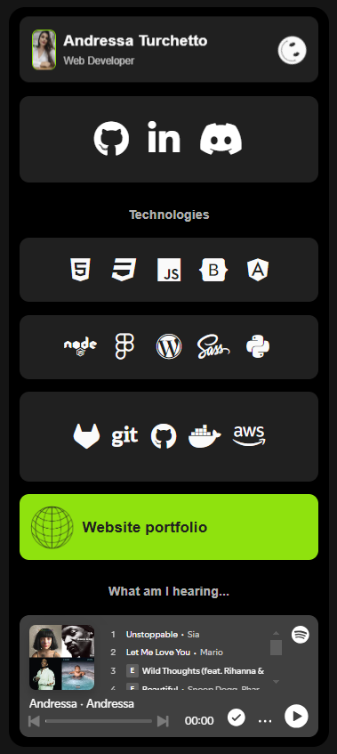

# Project Image


# My Links - Andressa Turchetto│Dev

This is a personal website developed by Andressa Turchetto to centralize important links and highlight skills and projects. The page includes widgets with personal information, technical skills, links to social networks, and more.

## Features

- **Custom Loading Screen:** An animated loading screen that shows progress in percentage until the site is completely loaded.
- **User Profile:** Developer information with photo, name and title.
- **Technical Skills:** Technology icons that highlight the developer's hard skills.
- **Links to Social Networks:** Direct links to GitHub, LinkedIn and GitHub.
- **Portfolio:** Links to personal portfolio website.

## Technologies 

- HTML5
- CSS3
- JavaScript
- FontAwesome para ícones
- Roboto Font do Google Fonts

## File Structure

```plaintext
/projeto
|-- index.html
|-- style.css
|-- animationLoading.js
|-- /img
    |-- user-perfil.png
    |-- smile-icon.png
    |-- web-black-icon.png
    |-- web-white-icon.png
    |-- tread-skateboard.jpg
```

## How to Use

1. Clone the repository to your local machine using `git clone [Repository URL]`.
2. Open the `index.html` file in a browser to view the website.
3. Explore the different sections by clicking on the available links and icons.
